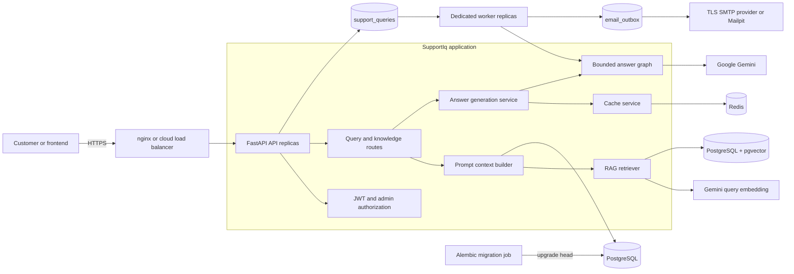
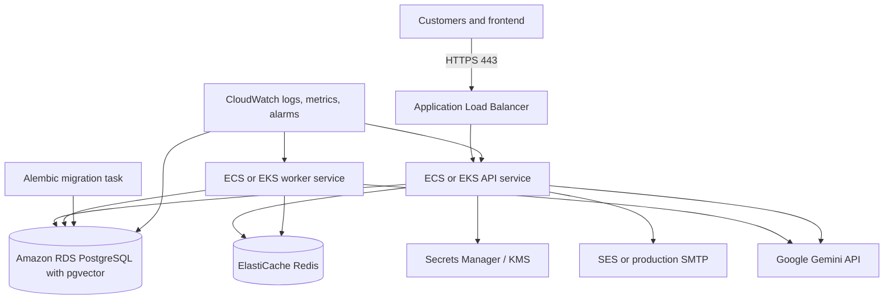
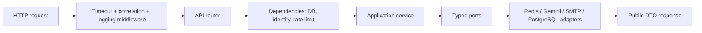
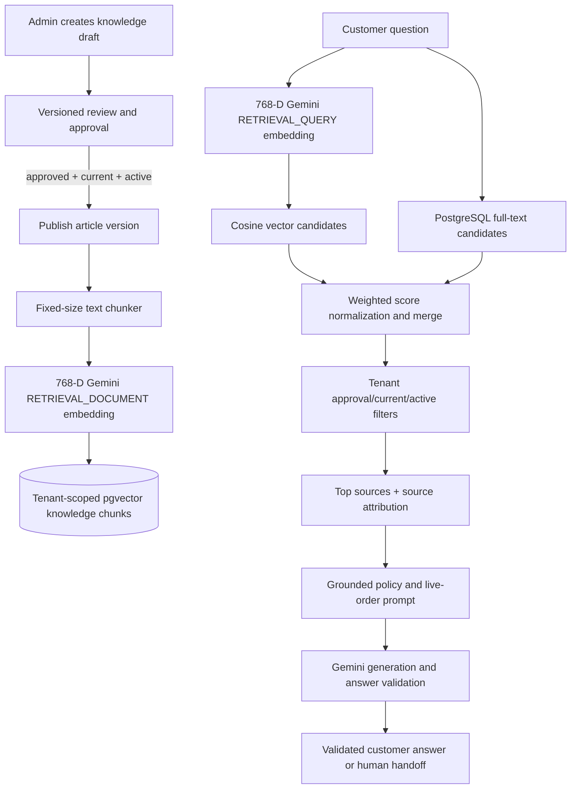
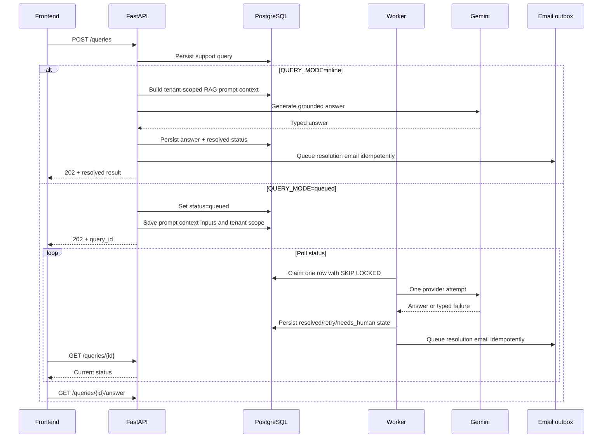
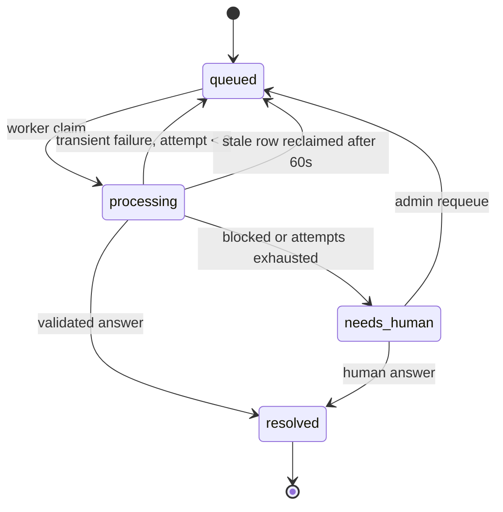

# SupportIq

SupportIq is an AI-powered customer-support backend built with FastAPI, PostgreSQL, Redis, and Google Gemini. It grounds answers in approved knowledge and verified order facts, supports inline and queued processing, and escalates unsafe or unresolved answers to human support.

> **Current status:** staging-ready local deployment with live Gemini, RAG, pgvector, PostgreSQL, Redis, queued workers, and TLS documentation verified. AWS or another managed production platform still needs real certificates or a load balancer, a production SMTP provider, secret-manager integration, backups, observability, and worker autoscaling/monitoring.

## Contents

1. [Capabilities](#capabilities)
2. [Architecture](#architecture)
3. [RAG retrieval pipeline](#rag-retrieval-pipeline)
4. [Application layer and abstractions](#application-layer-and-abstractions)
5. [Folder structure](#folder-structure)
6. [Query lifecycle](#query-lifecycle)
7. [Queue and retry behavior](#queue-and-retry-behavior)
8. [Email delivery](#email-delivery)
9. [Redis, caching, and rate limiting](#redis-caching-and-rate-limiting)
10. [Authentication and security](#authentication-and-security)
11. [API reference](#api-reference)
12. [Configuration](#configuration)
13. [Running locally](#running-locally)
14. [Testing](#testing)
15. [Deployment status and remaining work](#deployment-status-and-remaining-work)

## Capabilities

- FastAPI HTTP API with Pydantic request/response validation.
- Inline AI answering or durable PostgreSQL-backed queued answering.
- Dedicated worker service with `FOR UPDATE SKIP LOCKED` queue claims.
- AI answer validation, grounding checks, retry backoff, and human handoff.
- Google Gemini integration with typed provider errors, timeout limits, and retry handling.
- Redis-backed response caching and stampede-prevention locks.
- Redis-backed sliding-window rate limiting with fail-closed behavior when Redis is configured but unavailable.
- JWT access tokens and opaque, hashed, rotating refresh tokens.
- Admin-key protection for operational and write endpoints.
- Idempotent email outbox with database leases, retry recovery, and deterministic `Message-ID` values.
- PostgreSQL migrations managed by Alembic in a separate migration container.
- Structured JSON logging, correlation IDs, security headers, and request timeouts.
- LangGraph-based bounded AI workflow with no database or email side effects inside the graph.
- PostgreSQL `pgvector` support with versioned, tenant-scoped knowledge chunks.
- 768-dimensional Gemini document/query embeddings with RETRIEVAL_DOCUMENT and RETRIEVAL_QUERY task types.
- Opt-in hybrid retrieval combining normalized cosine-vector and PostgreSQL full-text scores.
- HNSW cosine search, approved/current/active knowledge filtering, source attribution, and context limits.
- Knowledge draft creation and admin approval; approval can publish and index the current version.
- STARTTLS and implicit SMTPS support, certificate verification, and production clear-text SMTP rejection.

## Architecture


```mermaid
flowchart LR
    Client[Customer or frontend] -->|HTTPS| Proxy[nginx or cloud load balancer]
    Proxy --> API[FastAPI API replicas]

    subgraph Application["SupportIq application"]
        API --> Auth[JWT and admin authorization]
        API --> Query[Query and knowledge routes]
        Query --> Context[Prompt context builder]
        Query --> Answer[Answer generation service]
        Answer --> Cache[Cache service]
        Context --> RAG[RAG retriever]
        Answer --> Graph[Bounded answer graph]
    end

    Cache --> Redis[(Redis)]
    RAG --> Embed[Gemini query embedding]
    RAG --> PgVector[(PostgreSQL + pgvector)]
    Context --> DB[(PostgreSQL)]
    Graph --> Gemini[Google Gemini]
    API --> Queue[(support_queries)]
    Queue --> Worker[Dedicated worker replicas]
    Worker --> Graph
    Worker --> Outbox[(email_outbox)]
    Outbox --> SMTP[TLS SMTP provider or Mailpit]
    Migration[Alembic migration job] -->|upgrade head| DB
```

The API process does not run the worker loop. Docker Compose starts migrations first, then starts API and worker services against the same PostgreSQL database.

### AWS deployment shape


```mermaid
flowchart TD
    Users[Customers and frontend] -->|HTTPS 443| ALB[Application Load Balancer]
    ALB --> API[ECS or EKS API service]
    API --> RDS[(Amazon RDS PostgreSQL with pgvector)]
    API --> Redis[(ElastiCache Redis)]
    API --> Secrets[Secrets Manager / KMS]
    API --> SMTP[SES or production SMTP]

    Worker[ECS or EKS worker service] --> RDS
    Worker --> Redis
    Worker --> Gemini[Google Gemini API]
    API --> Gemini
    Migration[Alembic migration task] --> RDS
    CloudWatch[CloudWatch logs, metrics, alarms] --> API
    CloudWatch --> Worker
    CloudWatch --> RDS
```

### HTTP request composition


```mermaid
flowchart LR
    R[HTTP request] --> MW[Timeout + correlation + logging middleware]
    MW --> Route[API router]
    Route --> Dep[Dependencies: DB, identity, rate limit]
    Dep --> UseCase[Application service]
    UseCase --> Ports[Typed ports]
    Ports --> Infra[Redis / Gemini / SMTP / PostgreSQL adapters]
    Infra --> Response[Public DTO response]
```

## RAG retrieval pipeline


```mermaid
flowchart TD
    Draft[Admin creates knowledge draft] --> Review[Versioned review and approval]
    Review -->|approved + current + active| Publish[Publish article version]
    Publish --> Chunk[Fixed-size text chunker]
    Chunk --> EmbedDoc[768-D Gemini RETRIEVAL_DOCUMENT embedding]
    EmbedDoc --> Index[(Tenant-scoped pgvector knowledge chunks)]

    Question[Customer question] --> QueryEmbed[768-D Gemini RETRIEVAL_QUERY embedding]
    QueryEmbed --> Vector[Cosine vector candidates]
    Question --> FTS[PostgreSQL full-text candidates]
    Vector --> Merge[Weighted score normalization and merge]
    FTS --> Merge
    Merge --> Tenant[Tenant approval/current/active filters]
    Tenant --> Sources[Top sources + source attribution]
    Sources --> Prompt[Grounded policy and live-order prompt]
    Prompt --> Gemini[Gemini generation and answer validation]
    Gemini --> Answer[Validated customer answer or human handoff]
```

- RAG is opt-in with `RAG_ENABLED=true`.
- Existing approved-policy and FAQ behavior remains a fallback when retrieval fails.
- The database never returns unapproved, inactive, wrong-tenant, or non-current chunks.
- Vector and full-text candidates are merged so semantic and exact-policy matches complement each other.
- The same prompt-context builder is used by inline and queued paths, keeping answer inputs consistent.
- Retrieved source metadata is retained for attribution and knowledge-version tracking.

## Application layer and abstractions

The application layer hides infrastructure details from routes and workers.

| Component | Responsibility |
|---|---|
| `AIAnswerer` port | Defines the provider contract without coupling workflows to Gemini. |
| `AnswerCachePort` | Defines cache and locking behavior without exposing Redis operations. |
| `AnswerGenerationService` | Owns cache keys, cache reads/writes, stampede locks, and answer generation. |
| `TextChunker` protocol | Defines replaceable document chunking behavior. |
| `DocumentEmbeddingGenerator` protocol | Defines document-vector adapter behavior independent of Gemini. |
| `KnowledgeChunkIndexer` protocol | Defines tenant-scoped chunk replacement and indexing behavior. |
| `QueryEmbeddingGenerator` protocol | Defines query-vector generation behavior independent of Gemini. |
| `KnowledgeStore` protocol | Defines vector/full-text retrieval without coupling the service to SQLAlchemy. |
| `KnowledgeRetriever` protocol | Defines provider-independent hybrid retrieval and source attribution. |
| `WorkerTask` protocol | Allows the worker runtime to run replaceable task implementations. |
| `run_support_graph` | Encapsulates generate → plan → validate → resolve/handoff behavior. |
| DTO schemas | Keep public API contracts separate from SQLAlchemy models. |

The inline query route and background worker use the same [AnswerGenerationService](app/application/services.py). This avoids duplicated cache/provider logic and makes fake providers and caches easy to use in tests.

## Folder structure

```text
supportiq/
├── alembic/
│   ├── env.py
│   └── versions/                    # Database migrations
├── app/
│   ├── main.py                      # FastAPI composition root
│   ├── api/v1/                      # HTTP routers and public endpoints
│   │   ├── auth.py
│   │   ├── health.py
│   │   ├── knowledge.py
│   │   ├── orders.py
│   │   └── queries.py
│   ├── application/                 # Use cases and stable ports
│   │   ├── ports.py
│   │   └── services.py
│   ├── core/                        # Database, security, cache, middleware
│   │   ├── cache.py
│   │   ├── database.py
│   │   ├── deps.py
│   │   ├── health.py
│   │   ├── logging.py
│   │   ├── middleware.py
│   │   └── security.py
│   ├── models/tables.py             # SQLAlchemy persistence model
│   ├── schemas/dto.py               # Pydantic API contracts
│   └── services/
│       ├── agent_graph.py           # Bounded AI workflow
│       ├── ai_service.py            # Gemini adapter and typed errors
│       ├── mail.py                  # Durable email outbox and SMTP adapter
│       ├── knowledge_indexing.py    # Chunking, document embeddings, pgvector writes
│       ├── knowledge_retrieval.py   # Query embeddings, hybrid retrieval, score merge
│       ├── prompt_context.py        # Knowledge and order grounding
│       └── worker.py                # Queue claim, retry, reaper, runtime
├── tests/                           # Offline unit and integration tests
├── Dockerfile
├── docker-compose.yml
├── requirements.txt
└── README.md
```

## Query lifecycle


```mermaid
sequenceDiagram
    participant F as Frontend
    participant A as FastAPI
    participant D as PostgreSQL
    participant W as Worker
    participant G as Gemini
    participant E as Email outbox

    F->>A: POST /queries
    A->>D: Persist support query
    alt QUERY_MODE=inline
        A->>D: Build tenant-scoped RAG prompt context
        A->>G: Generate grounded answer
        G-->>A: Typed answer
        A->>D: Persist answer + resolved status
        A->>E: Queue resolution email idempotently
        A-->>F: 202 + resolved result
    else QUERY_MODE=queued
        A->>D: Set status=queued
        A->>D: Save prompt context inputs and tenant scope
        A-->>F: 202 + query_id
        loop Poll status
            W->>D: Claim one row with SKIP LOCKED
            W->>G: One provider attempt
            G-->>W: Answer or typed failure
            W->>D: Persist resolved/retry/needs_human state
            W->>E: Queue resolution email idempotently
            F->>A: GET /queries/{id}
            A-->>F: Current status
        end
        F->>A: GET /queries/{id}/answer
    end
```

## Queue and retry behavior


```mermaid
stateDiagram-v2
    [*] --> queued
    queued --> processing: worker claim
    processing --> resolved: validated answer
    processing --> queued: transient failure, attempt < 3
    processing --> needs_human: blocked or attempts exhausted
    processing --> queued: stale row reclaimed after 60s
    needs_human --> queued: admin requeue
    needs_human --> resolved: human answer
    resolved --> [*]
```

- Queue claims use PostgreSQL row locking and `SKIP LOCKED`.
- Each worker attempt makes one Gemini call.
- Retry backoff is 2, 4, and 8 minutes.
- Maximum AI attempts per query: 3.
- Blocked or unsafe model output goes directly to human support.
- A stale `processing` row is reclaimed after 60 seconds.
- The worker heartbeat is stored in Redis when available and exposed through admin queue statistics.

## Email delivery

The `email_outbox` table is the durable source of truth for outbound resolution mail.

- `idempotency_key` prevents duplicate queue rows.
- `sending` rows have `locked_at` and `locked_by` delivery leases.
- Workers claim rows with a short database transaction before calling SMTP.
- Stale leases are recoverable after the delivery lease expires.
- A deterministic `Message-ID` is generated from the idempotency key.
- SMTP supports STARTTLS and implicit SMTPS.
- TLS certificate verification is enabled; production rejects clear-text SMTP when `SMTP_REQUIRE_TLS=true`.
- Raw SMTP is still technically at-least-once if a process crashes after SMTP accepts a message but before the database is updated. A provider with idempotency-key support is required for stronger exactly-once behavior.

Mailpit is used only for local development. Production must use a real transactional email provider with TLS, credentials, bounce monitoring, and provider-side idempotency support.

## Redis, caching, and rate limiting

| Feature | Implementation |
|---|---|
| Distributed rate limiting | Redis sliding window, 30 protected requests per client per minute |
| Rate-limit key privacy | HMAC digest; raw client IP is not stored in Redis |
| AI response cache | Redis, 600-second default TTL |
| Cache stampede lock | Redis `SET NX` lock with configurable TTL |
| Worker heartbeat | Redis hash with 30-second expiry |
| Redis failure behavior | Cache degrades safely; configured rate-limit failures return `503` rather than silently removing protection |
| Local fallback | In-memory rate limiter only when `REDIS_URL` is not configured |

## Authentication and security

- Access tokens use HS256 with a configured secret and a 15-minute lifetime.
- Refresh tokens are opaque random values; only SHA-256 hashes are stored.
- Refresh-token rotation detects reuse and revokes the entire token family.
- Admin endpoints require `X-Admin-Key` and fail closed when no key is configured.
- Customer data access is scoped to the verified JWT email in production.
- Passwords use PBKDF2-HMAC-SHA256 with 210,000 iterations and per-user salts.
- Request IDs, structured logging, secret redaction, security headers, and a configurable request timeout are enabled.
- API and worker containers run as a non-root user.

Production still needs HTTPS at a reverse proxy, secret-manager integration, secure `HttpOnly` refresh-token cookies with CSRF protection, admin rate limiting, dependency/image scanning, and tested backup restoration.

## Public API error contract

Client and service failures use an abstract error hierarchy in
`app/core/api_errors.py`. Public responses include a stable `detail` field for
backward compatibility plus a structured `error` object:

```json
{
  "detail": "Request contains invalid fields",
  "error": {
    "code": "validation_error",
    "message": "Request contains invalid fields",
    "fields": ["customer_email"]
  }
}
```

Validation handlers expose field locations but no Pydantic internals, values,
provider payloads, SQL statements, or stack traces. Unexpected exceptions are
logged internally and returned as generic `500 internal_error` responses.

## API reference

### Queries

| Method | Endpoint | Purpose | Authentication |
|---|---|---|---|
| POST | `/queries` | Submit a support query; returns `202` | JWT required in production |
| GET | `/queries/{query_id}` | Read query status | JWT required in production |
| GET | `/queries/{query_id}/answer` | Read the latest answer | JWT required in production |
| PATCH | `/queries/{query_id}/feedback` | Submit a 1–5 rating and comment | JWT required in production |
| PATCH | `/queries/{query_id}` | Admin status transition | Admin key |
| PATCH | `/queries/{query_id}/answer` | Submit a human answer | Admin key |
| POST | `/queries/{query_id}/requeue` | Requeue processing/human-review item | Admin key |
| GET | `/admin/needs-human` | List human-support items | Admin key |

### Authentication

| Method | Endpoint | Purpose |
|---|---|---|
| POST | `/auth/login` | Issue access and refresh tokens |
| POST | `/auth/refresh` | Rotate a refresh token |
| POST | `/auth/logout` | Revoke a refresh-token family member |

### Operations and data

| Method | Endpoint | Purpose |
|---|---|---|
| GET | `/healthz` | Database and Gemini health probe |
| GET | `/admin/queue-stats` | Queue counts and worker heartbeat; admin key |
| POST | `/orders` | Create order and events; admin key |
| GET | `/orders/{order_number}` | Read authenticated order tracking |
| POST | `/knowledge` | Create a draft knowledge answer; admin key |
| POST | `/knowledge/{knowledge_answer_id}/versions/{version_id}/approve` | Approve and optionally index a knowledge version; admin key |

The frontend must support `queued`, `processing`, `resolved`, `needs_human`, and `closed` states. In queued mode, it should poll `/queries/{query_id}` and request `/queries/{query_id}/answer` after resolution.

## Configuration

Copy `.env.example` to `.env` and replace every placeholder with a secure value.

| Variable | Default | Required | Description |
|---|---:|:---:|---|
| `DATABASE_URL` | — | Yes | SQLAlchemy PostgreSQL URL |
| `POSTGRES_USER` | `supportiq` | No | Compose database user |
| `POSTGRES_PASSWORD` | — | Yes for Compose | Compose database password |
| `POSTGRES_DB` | `supportiq` | No | Compose database name |
| `GEMINI_API_KEY` | — | Yes | Google Gemini credential |
| `JWT_SECRET_KEY` | — | Yes | Access-token signing secret |
| `ADMIN_API_KEY` | — | No | Admin key; absent means fail closed |
| `CACHE_KEY_SECRET` | — | Yes with Redis | HMAC secret for cache/rate-limit keys |
| `REDIS_URL` | — | No locally | Redis URL for distributed cache and limiting |
| `DB_POOL_SIZE` | `20` | No | PostgreSQL persistent pool size per API process |
| `DB_MAX_OVERFLOW` | `40` | No | PostgreSQL overflow connections per API process |
| `CORS_ALLOWED_ORIGINS` | empty | Production frontend | Exact comma-separated origins; no wildcard default |
| `CORS_ALLOW_CREDENTIALS` | `false` | No | Allow credentials for configured CORS origins |
| `RAG_ENABLED` | `false` | No | Enable tenant-scoped vector/hybrid knowledge retrieval |
| `EMBEDDING_MODEL` | `gemini-embedding-001` | No | Gemini embedding model used for documents and queries |
| `AI_CACHE_TTL_SECONDS` | `600` | No | Successful answer cache TTL |
| `AI_CACHE_LOCK_SECONDS` | `15` | No | Cache stampede lock TTL |
| `QUERY_MODE` | `inline` | No | `inline` or `queued`; Compose uses `queued` |
| `REFRESH_TOKEN_MINUTES` | `720` | No | Absolute refresh-token lifetime |
| `TLS_FULLCHAIN_PATH` | `./certs/fullchain.pem` | Compose HTTPS | PEM certificate chain |
| `TLS_PRIVATE_KEY_PATH` | `./certs/privkey.pem` | Compose HTTPS | PEM private key; never commit it |
| `ALLOWED_HOSTS` | `localhost,127.0.0.1` | Production | Comma-separated public hostnames |
| `EMAIL_DELIVERY_LEASE_SECONDS` | `120` | No | Email outbox lease duration |
| `WORKER_ID` | hostname | No | Must be unique when scaling workers |
| `SMTP_HOST` | `localhost` | No | SMTP host; Compose uses Mailpit |
| `SMTP_PORT` | `1025` | No | SMTP port |
| `SMTP_USER` | empty | No | SMTP username |
| `SMTP_PASSWORD` | empty | No | SMTP password |
| `SMTP_USE_TLS` | `true` when user/password is set | No | Upgrade an SMTP connection with STARTTLS |
| `SMTP_USE_SSL` | `false` | No | Use implicit SMTPS (typically port 465) |
| `SMTP_REQUIRE_TLS` | `true` in production | No | Reject SMTP delivery unless STARTTLS or SMTPS is enabled |
| `MAIL_FROM` | `support@supportiq.local` | No | Sender address |
| `MAIL_FROM_NAME` | `SupportIq` | No | Sender display name |

## Running locally

### Docker Compose

Docker Compose starts PostgreSQL, Redis, Mailpit, nginx TLS termination, the Alembic migration service, the API, and the dedicated worker.

```powershell
docker compose up --build
```

Endpoints:

- API: `https://127.0.0.1`
- Health: `https://127.0.0.1/healthz`
- HTTP redirect: `http://127.0.0.1` redirects to HTTPS
- Mailpit UI: `http://127.0.0.1:8025`
- SMTP: `127.0.0.1:1025`

### TLS certificates

Place a certificate chain and private key at `certs/fullchain.pem` and `certs/privkey.pem`, or set `TLS_FULLCHAIN_PATH` and `TLS_PRIVATE_KEY_PATH` to managed certificate paths. Use certificates issued for the actual public domain. Private key files and the `certs/` directory are excluded from Git.

For local development with a self-signed certificate, generate one only for testing:

```powershell
New-Item -ItemType Directory -Force certs
openssl req -x509 -nodes -days 30 -newkey rsa:2048 -keyout certs/privkey.pem -out certs/fullchain.pem -subj "/CN=localhost"
```

Self-signed certificates are not trusted by browsers or production clients. Production must use a CA-issued certificate and `ALLOWED_HOSTS` must contain only the approved domain names.

Stop services while preserving volumes and database data:

```powershell
docker compose stop
```

Start them again:

```powershell
docker compose start
```

Do not use `docker compose down -v` unless intentionally deleting the local database and Redis volumes.

### Local Python process

```powershell
python -m venv .venv
.\.venv\Scripts\Activate.ps1
pip install -r requirements.txt
uvicorn app.main:app --reload
```

For queued processing in a separate terminal:

```powershell
$env:QUERY_MODE = "queued"
python -m app.services.worker
```

## Testing

Tests are designed to run offline with SQLite and mocked AI behavior.

```powershell
python -m pytest -q
```

The latest verified run passed **217 tests**. Coverage includes API behavior, authentication and refresh-token rotation, privacy, tenant isolation, queue claims and reaping, worker lifecycle substitution, AI graph validation, email outbox behavior, knowledge chunking/indexing, RAG retrieval, application-service ports, and health endpoints.

Live Docker verification has also confirmed:

- PostgreSQL migrations reach Alembic head `b3c4d5e6f7a8`.
- pgvector is enabled and HNSW cosine indexing is available.
- Nine approved policy articles are indexed with 768-dimensional embeddings.
- A normal Gemini answer correctly uses the 30-day refund policy.
- A prompt-injection attempt requesting secrets is refused without exposing credentials.
- `/readyz` returns HTTP `200` when the live stack is ready.

Static diagnostics and `git diff --check` should also be run before committing.

## Deployment status and remaining work

### Implemented

- Dockerfile with Python 3.12 slim base and non-root runtime user.
- Separate migration, API, and worker services.
- PostgreSQL health-gated migrations.
- Redis-backed distributed rate limiting and answer caching.
- Durable worker queue and email outbox.
- Alembic schema migrations through RAG head `b3c4d5e6f7a8`.
- Separate `/livez` and `/readyz` health endpoints.
- pgvector chunk storage, tenant-aware hybrid retrieval, and HNSW cosine indexing.
- 768-dimensional Gemini document and query embeddings.
- Knowledge draft approval with optional document indexing.
- STARTTLS and implicit SMTPS support with production clear-text rejection.
- Nginx TLS 1.2/1.3 reverse proxy with HTTP-to-HTTPS redirect, HSTS, and security headers.
- Application ports and service layer for answer generation.
- Structured logs, correlation IDs, timeout middleware, and security headers.

### Required before production

- Replace Mailpit with a production transactional email provider.
- Add CORS configuration for the deployed frontend origin.
- Configure and verify real certificate paths for the public domain.
- Enable worker healthchecks and unique worker IDs when scaling.
- Add PostgreSQL backups and a tested restore procedure.
- Add metrics, centralized logs, queue alerts, and provider failure alerts.
- Add retrieval-quality datasets and tune the similarity threshold.
- Add retry or dead-letter handling for knowledge-vector indexing failures.
- Add cross-tenant live retrieval and real PostgreSQL embedding checks to staging.
- Add AWS infrastructure-as-code and managed-service configuration.
- Move secrets to a managed secret store.
- Add frontend integration tests and normalize error responses.
- Protect refresh-token rotation with a database row lock for concurrent refresh requests.
- Recalculate connection-pool limits when running multiple API replicas.

## License

Private / internal use.

---

*Last updated: 2026-11-06*
